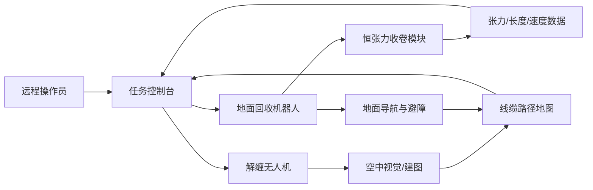

# 系统架构

## 总体架构

## 无人机子系统

职责：

- 俯视巡检，生成光纤路径和缠绕点候选。
- 近距离观察缠绕点，判断是否可处理。
- 使用轻量末端工具辅助解缠：拨线、抬线、放线、导向。
- 给地面机器人提供“可继续收卷/需要暂停/需要人工处理”的信号。

建议模块：

- 飞控：成熟开源或商用飞控，支持位置保持、限高、返航。
- 传感器：广角相机、云台相机、深度相机或小型激光雷达。
- 末端工具：轻量导线钩、柔性夹爪、可释放导环。
- 安全：螺旋桨保护、电子围栏、失联返航、紧急释放。

不建议在早期做：

- 用无人机直接大力拉拽长距离光纤。
- 在强风、废墟上方低空穿越复杂钢筋。
- 自主接近疑似电力线或未爆物。

## 地面机器人子系统

职责：

- 沿光纤路径慢速移动。
- 通过收卷盘回收光纤。
- 用张力闭环避免拉断、弹回或拖动危险物。
- 记录回收长度、位置和异常点。

建议模块：

- 底盘：履带或四轮差速底盘，优先考虑低速、稳定、可越障。
- 收卷盘：可拆卸卷盘、导向轮、排线机构、刹车。
- 传感器：张力传感器、编码器、前视相机、深度相机、IMU、GNSS/RTK。
- 执行器：收卷电机、线缆夹持器、导向臂、急停释放机构。
- 通信：本地无线链路，支持断联自动停止。

## 任务流程

1. 现场预检查：导入禁入区、风险点和任务边界。
2. 空中巡检：无人机低风险高度巡查，生成线缆路径草图。
3. 地面定位：地面机器人找到线缆起点并夹持。
4. 试拉检测：低张力短距离牵引，确认线缆可移动。
5. 协同回收：地面机器人收卷，无人机在前方观察缠绕点。
6. 异常处理：张力突增或视觉确认缠绕时暂停，派无人机解缠。
7. 完成记录：生成回收长度、路径、异常和损坏报告。

## 控制原则

- 地面机器人是牵引主控，无人机是感知和辅助处理节点。
- 张力限制优先级高于回收速度。
- 视觉不确定时降低速度或停机。
- 危险识别不做“自动硬闯”，只做停止、标记和请求人工确认。

